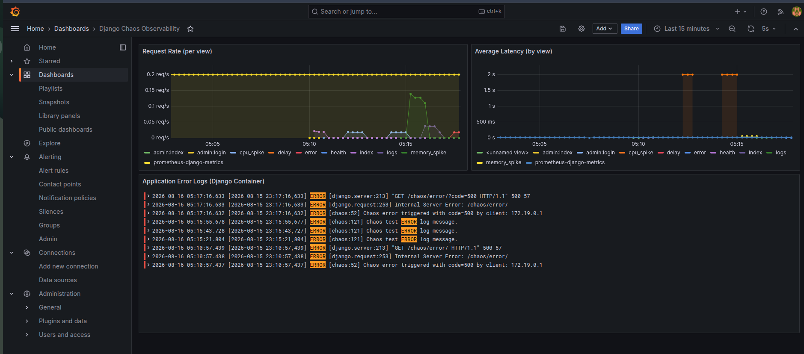

# 📊 Django Full-Stack Observability & Chaos Engineering

[](https://github.com/FForhad/django-observability/actions/workflows/ci.yml)
[](https://www.djangoproject.com/)
[](https://prometheus.io/)
[](https://grafana.com/)
[](https://grafana.com/oss/loki/)
[](https://www.docker.com/)

A production-grade observability and monitoring stack for **Django applications** featuring **Prometheus** (metrics), **Grafana** (dashboards), **Loki** (log aggregation), and **Promtail** (log collection), coupled with a dedicated **Chaos Engineering API** to simulate real-world traffic anomalies, error rates, CPU/memory spikes, and latency regressions.

---

## 📸 Live Dashboard Preview



> **Featured Dashboard Panels:**
> 1. **Request Rate (per view)**: Real-time throughput tracking across views (`/chaos/delay/`, `/chaos/error/`, `/chaos/cpu/`, etc.).
> 2. **Average Latency (by view)**: p95/p99 latency tracking detecting artificial delays and CPU intensive tasks.
> 3. **Application Error Logs**: Live LogQL stream panel from Loki filtering application errors and unhandled exceptions.

---

## 🏗️ Architecture & Data Flow

```
                     +----------------------------------------------------+
                     |                 Docker Compose                     |
                     |                                                    |
+-----------------+  |  +--------------------+        +----------------+  |
|  Client Traffic |---->| Django Application |------->| /metrics (app) |  |
| & Chaos Tests   |  |  |    (Port 8000)     |        +-------+--------+  |
+-----------------+  |  +---------+----------+                |           |
                     |            | (Rotating Logs)           | Scraped   |
                     |            v                           v every 5s  |
                     |     +--------------+           +---------------+   |
                     |     | /var/log/    |           |  Prometheus   |   |
                     |     | django/*.log |           |  (Port 9090)  |   |
                     |     +------+-------+           +-------+-------+   |
                     |            |                           |           |
                     |            v Scraped                   |           |
                     |     +--------------+                   |           |
                     |     |   Promtail   |                   |           |
                     |     +------+-------+                   |           |
                     |            |                           |           |
                     |            v Pushed                    v PromQL    |
                     |     +--------------+           +---------------+   |
                     |     |     Loki     |---------->|    Grafana    |<----+ (Port 3000)
                     |     | (Port 3100)  |   LogQL   |  Dashboards   |
                     |     +--------------+           +---------------+
                     +----------------------------------------------------+
```

---

## 📁 Repository Structure

```text
django-observability/
├── app/
│   ├── chaos/                   # Chaos engineering app for telemetry generation
│   │   ├── __init__.py
│   │   ├── views.py             # Latency, error, CPU, memory, log generator endpoints
│   │   ├── urls.py              # Chaos routing
│   │   └── tests.py             # Automated metrics & chaos endpoint test suite
│   ├── config/                  # Django project root settings
│   │   ├── __init__.py
│   │   ├── asgi.py
│   │   ├── settings.py          # Prometheus middleware & rotating logging setup
│   │   ├── urls.py              # Exposes /metrics & /chaos/
│   │   └── wsgi.py
│   ├── manage.py
│   ├── requirements.txt         # Django, django-prometheus, gunicorn, etc.
│   └── Dockerfile               # Production container image
├── prometheus/
│   └── prometheus.yml           # Prometheus scrape configurations
├── loki/
│   └── loki-config.yaml         # Loki storage & TSDB schema config
├── promtail/
│   └── promtail-config.yaml     # Promtail log pipeline & JSON parsing
├── docker-compose.yml           # Multi-container orchestration
├── image.png                    # Live dashboard screenshot proof
└── README.md
```

---

## 🚀 Quick Start Guide

### Prerequisites
- [Docker](https://docs.docker.com/get-docker/) (v20.10+)
- [Docker Compose](https://docs.docker.com/compose/install/) (v2.0+)

### 1. Clone & Navigate
```bash
git clone https://github.com/FForhad/django-observability.git
cd django-observability
```

### 2. Launch the Entire Stack
```bash
docker compose up --build -d
```

### 3. Service Ports & URLs

| Service | URL | Default Credentials | Description |
| :--- | :--- | :--- | :--- |
| **Django App** | `http://localhost:8000` | N/A | Application & Chaos API |
| **Django Metrics** | `http://localhost:8000/metrics` | N/A | Prometheus metric scrape target |
| **Prometheus UI** | `http://localhost:9090` | None | Metric explorer & target health |
| **Grafana** | `http://localhost:3000` | `admin` / `admin` | Telemetry dashboards |
| **Loki** | `http://localhost:3100` | N/A | Log aggregation engine |

---

## 💥 Chaos Testing & Telemetry Simulation

Use these endpoints to simulate various production failure scenarios and observe real-time telemetry spikes in Grafana:

### 1. Health Check
```bash
curl http://localhost:8000/chaos/health/
```

### 2. Simulate Latency / Slow Response (Observe Latency Panel)
```bash
# Injects a 2-second delay
curl "http://localhost:8000/chaos/delay/?seconds=2"
```

### 3. Trigger HTTP 500 Errors (Observe Error Rate & Loki Logs)
```bash
# Simulate 500 Internal Server Error
curl "http://localhost:8000/chaos/error/?code=500"

# Trigger an unhandled Python Exception
curl "http://localhost:8000/chaos/error/?code=exception"
```

### 4. CPU Spike Simulation (Observe Container CPU Metrics)
```bash
# Runs intensive CPU computation for 2.5 seconds
curl "http://localhost:8000/chaos/cpu/?duration=2.5"
```

### 5. Memory Allocation Spike
```bash
# Temporarily allocates and frees 50MB of memory
curl "http://localhost:8000/chaos/memory/?mb=50"
```

### 6. Generate Multi-Level Structured Logs (Observe Loki Stream)
```bash
# Emits DEBUG, INFO, WARNING, ERROR, and CRITICAL logs
curl "http://localhost:8000/chaos/logs/?level=all"
curl "http://localhost:8000/chaos/logs/?level=error"
```

### 🔁 Automated Traffic Load Generator (Bash Loop)
To produce continuous data for your dashboard:
```bash
while true; do
  curl -s http://localhost:8000/chaos/health/ > /dev/null
  curl -s "http://localhost:8000/chaos/delay/?seconds=1" > /dev/null
  curl -s "http://localhost:8000/chaos/error/?code=500" > /dev/null
  curl -s "http://localhost:8000/chaos/logs/?level=error" > /dev/null
  sleep 1
done
```

---

## 📈 Grafana Configuration & Queries

### 1. Data Sources
In Grafana (`http://localhost:3000`), add the following data sources under **Connections > Data Sources**:
- **Prometheus**:
  - URL: `http://prometheus:9090`
- **Loki**:
  - URL: `http://loki:3100`

### 2. Useful PromQL Queries

| Metric | PromQL Query |
| :--- | :--- |
| **Request Rate (req/s)** | `sum(rate(django_http_requests_total_by_view_transport_method_total[1m])) by (view)` |
| **Average Response Latency** | `sum(rate(django_http_requests_latency_including_middlewares_by_view_method_seconds_sum[1m])) by (view) / sum(rate(django_http_requests_latency_including_middlewares_by_view_method_seconds_count[1m])) by (view)` |
| **Error Rate (5xx)** | `sum(rate(django_http_responses_total_by_status_total{status=~"5.."}[1m]))` |
| **Database Operations** | `rate(django_db_query_duration_seconds_count[1m])` |

### 3. Useful LogQL Queries (Loki)

| Log Stream | LogQL Query |
| :--- | :--- |
| **All Django Logs** | `{job="django"}` |
| **Error / Exception Logs** | `{job="django"} \|= "ERROR"` |
| **Chaos Triggered Errors** | `{job="django"} \|~ "Chaos error triggered"` |

---

## 💻 Local Development (Without Docker)

If you wish to run the Django service locally:

```bash
# 1. Create and activate virtual environment
python3 -m venv .venv
source .venv/bin/activate

# 2. Install requirements
pip install -r app/requirements.txt

# 3. Apply database migrations
python app/manage.py migrate

# 4. Run automated tests
python app/manage.py test chaos

# 5. Start local development server
python app/manage.py runserver 0.0.0.0:8000
```

---

## 🧪 Automated Testing

The project includes unit and integration tests verifying both Prometheus metrics exposure and all chaos injection endpoints:

```bash
# Run tests inside virtual environment
python app/manage.py test chaos -v 2

# Or inside Docker container
docker compose exec django python manage.py test chaos
```

| Test Class | Coverage |
| :--- | :--- |
| **`ObservabilityMetricsTests`** | Validates `/metrics` status 200, Prometheus `# HELP`/`# TYPE` annotations, and request counters. |
| **`ChaosEndpointsTests`** | Validates `/chaos/health/`, `/chaos/delay/`, `/chaos/error/`, `/chaos/cpu/`, `/chaos/memory/`, and multi-level logging. |

---

## 🛡️ Best Practices Implemented
- ✅ **Metrics Isolation**: `django_prometheus` middleware placed at the extreme ends of the request/response cycle for accurate request latency tracking.
- ✅ **Zero Blocking Log Pipeline**: Promtail scrapes file-based rotating logs asynchronously without affecting web worker performance.
- ✅ **Structured Context**: Django logs capture logger names, file lines, levels, and timestamps parsed into indexed labels by Promtail.
- ✅ **Containerized Isolation**: Isolated bridge network for all monitoring components.

---

## 📜 License
This project is licensed under the MIT License - see the [LICENSE](LICENSE) file for details.
